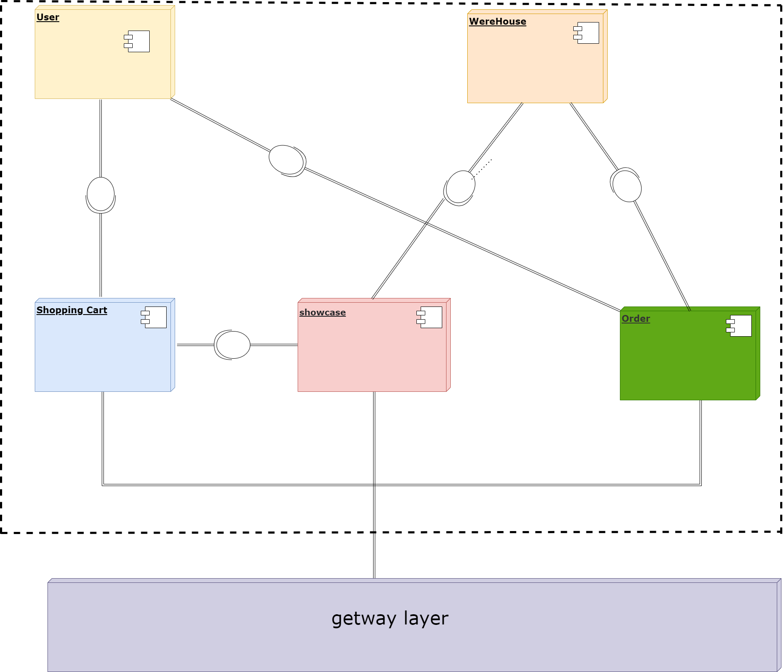

#example-service-environment-with-a-focus-on-resilience
Esse projeto faz parte de um estudo em que tem o foco na criação de arquitetura de microserviços tolerante a falhas, atravez desse repositorio iremos realizar teste, recebe metricas que validem as porposta descritas no artigo  do artigo " Uma taxonomia preliminar de padrões para o desenvolvimento de microsserviços tolerantes a falhas".

### 📋 Pré-requisitos
Ambiente Java

### 🔧 Instalação
IDE suporte java

# springboot

Minimal [Spring Boot](http://projects.spring.io/spring-boot/) sample app.

## Requisitos

For building and running the application you need:

- [JDK 1.8](http://www.oracle.com/technetwork/java/javase/downloads/jdk8-downloads-2133151.html)
- [Maven 3](https://maven.apache.org)

##Diagrama de componentes
